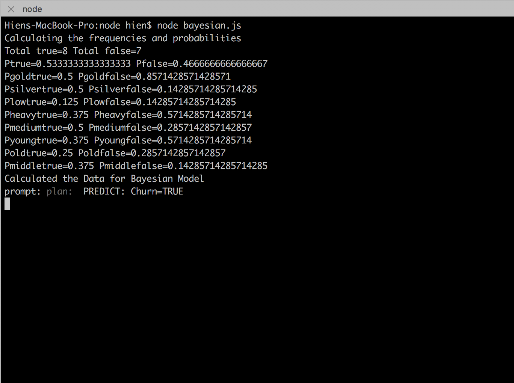

## Project overview 

#### Step
1. Dataset 
2. Algorithm for churn detection 
3. Load data in hadoop 
+ Load data to HDFS 
+ MapReduce program to build the model 
+ Parallel processing offered by MapReduce can build the model in a short span of time 
4. Run analysis

### Solution  
+ Build model to take customer churn as input to predict the future churners 
+ Bayes' theorem 
+ Run bayes algo in prompt with Node.js 

### Building churn predictor using Hadoop 
+ Synthetic dataset for testing 
    + `http://www.generatedata.com/`
    + `http://chancejs.com/`
    + `https://github.com/nodeca/charlatan`
    + `https://github.com/weaver/moniker`
+ Prepare a synthetic historical churn dataset 

### Run the project 
+ Create dir : `hadoop fs -ls /churn-detection `
+ Create /in and /out 

#### Datasets 
+ Pre processing of raw data 
+ Deal with structured, semi-structured and unstructured datasets