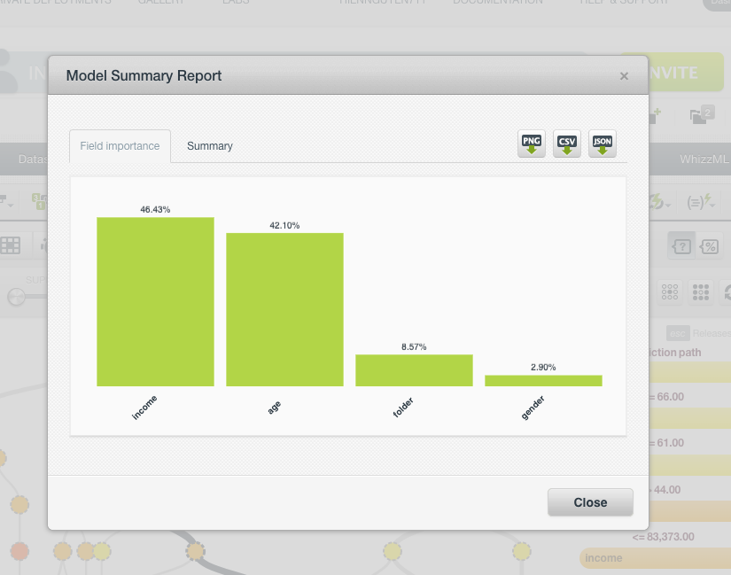

## Project overview 

+ Batch analytics 
+ ML: supervised learning model with Classification 
+ MapReduce job to generate a list of customer who are not likely to respond to offer 

### Solution : 
+ Classification machine learning model - Binary classification
+ Tree based learning approach 
+ Finding the right dataset : age, income, gender, folder, response 
+ Train classification model - Scoring 

#### Building machine learning model with BigML 
+ BigML: web-based tool, data processing is done in the cloud 

#### Model building steps 
1. Upload data file : responsedata.csv 
2. Create dataset with data file 
+ See the summary chart of it 
3. Build classification model 
+ Browse decision tree created by BigML 
+ As shown from Prediction path: Age and Income is the 2 most important factor 
+ Model summary report 

4. Download classification model 
+ Make selection of data from database 
+ Use the classification model to predict 
+ Scoring process 
5. Run the model using MapReduce on Hadoop for scoring
+ Run the model on Hadoop 
+ MapReduce job 

#### Run the project on Hadoop with MapReduce 
+ `mvn package`

